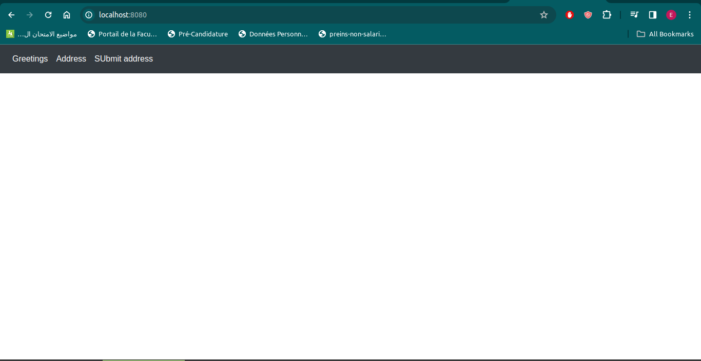
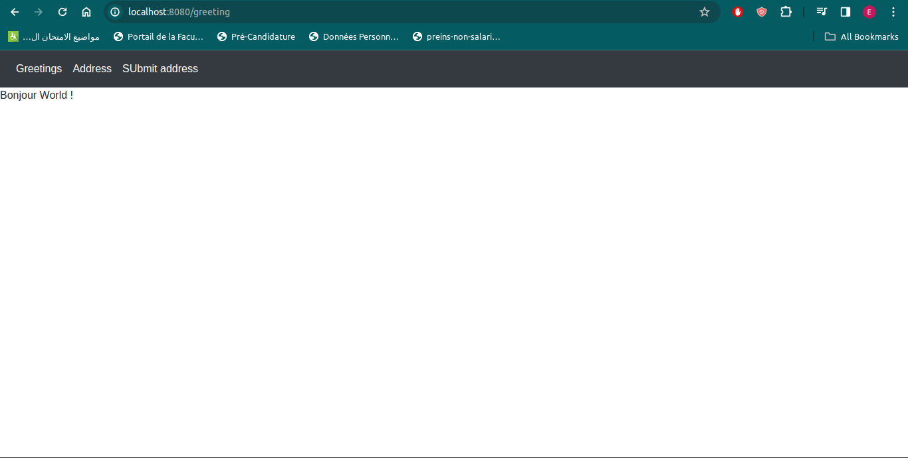
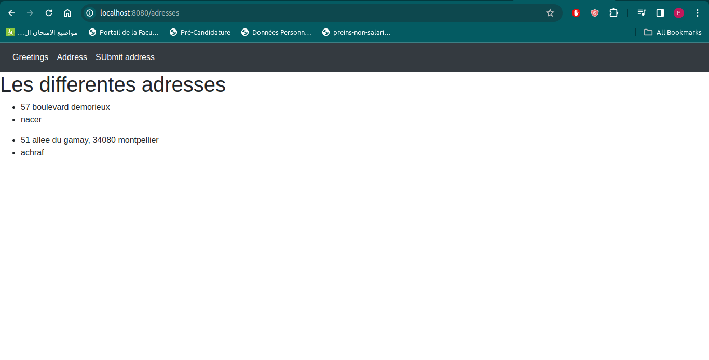
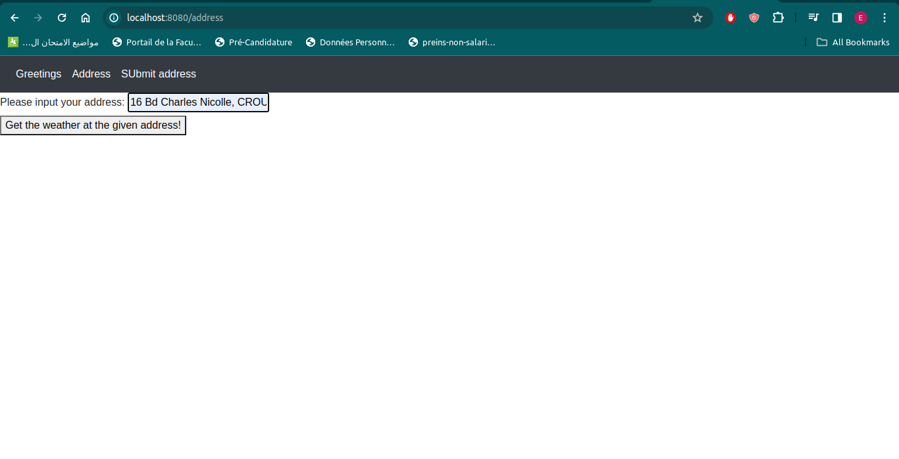
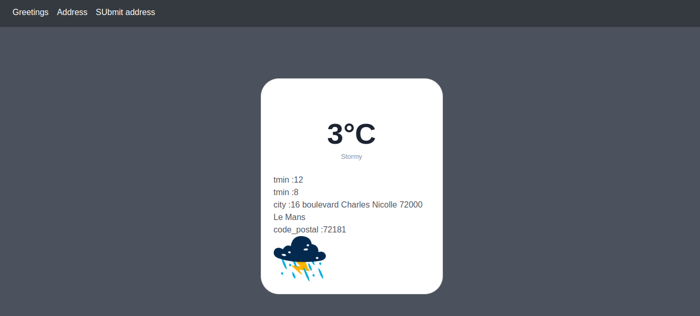

# JAVA API_POO tp avec SPRING BOOT 
## TP3
### etape 5

Technologies et Leur Utilité
Spring Web : Propose des outils essentiels pour développer des applications web, intégrant des fonctionnalités telles que le modèle MVC de Spring, la prise en charge des requêtes REST, et la sérialisation des données.

Spring Data JPA : Facilite la gestion des données en proposant une interface simplifiée pour réaliser des opérations CRUD, tout en assurant une intégration fluide avec JPA.

H2 Database : Base de données légère et en mémoire, idéale pour les phases de développement et de test, ne nécessitant aucune installation séparée.

Thymeleaf : Un moteur de rendu de templates pour générer des vues HTML dynamiques, permettant d'intégrer des données côté serveur dans les interfaces utilisateur.

Spring Boot DevTools : Offre un ensemble d'outils destinés à optimiser le développement sous Spring Boot, notamment via le rechargement automatique du code et des ressources.

### Étape 13 - Fonctionnement du Contrôleur HelloWorldController
Configuration de l'URL : Avec @GetMapping("/greeting"), cette annotation spécifie que la méthode greeting répond à l'URL /greeting.

Sélection du Template HTML : La méthode greeting renvoie "greeting", indiquant à Thymeleaf de charger greeting.html.

Transmission de Données aux Vues : L'utilisation de @RequestParam permet de capter le paramètre nameGET de la requête, qui est ensuite passé au modèle et affiché dans greeting.html.

### Étape 17 - Observation dans la Console H2
Création Automatique de Table : La présence de la table ADDRESS dans la base de données H2 est une conséquence directe de l'annotation @Entity dans la classe Address.

### Etape 18 - Logique de Création de Table par Hibernate
Mécanisme d'Hibernate : Exploitant les annotations JPA dans Address, Hibernate configure et crée automatiquement la table correspondante.

### Étape 20 - Validation des Données dans H2
Confirmation des Insertions : Les données de data.sql ont été correctement insérées dans la table Address, comme le démontre la requête SELECT effectuée dans la console H2.

### Étape 22 - Explication de @Autowired
Injection de Dépendances : @Autowired facilite l'injection de AddressRepository dans AddressController, démontrant l'efficacité de Spring en matière de gestion des dépendances.

### Étape 27 - Intégration d'une Barre de Navigation
Utilisation de Bootstrap et Thymeleaf : La navbar ajoutée améliore la navigation et l'esthétique du site grâce à l'intégration de Bootstrap et Thymeleaf.

### Étape 30 - Ajout de Bootstrap via Maven
<dependency>
<groupId>org.webjars</groupId>
<artifactId>bootstrap</artifactId>
<version>5.3.0</version> <!-- Adjust the version to the latest available -->
</dependency>

## TP4 : Application Web avec API Météo
Dans ce TP4, nous avons développé une application web sophistiquée qui se sert de l'API MeteoConcept pour offrir des prévisions météorologiques basées sur des données GPS. Ce travail a impliqué l'intégration complexe d'APIs externes et le traitement de données météorologiques et géographiques.

Interaction avec l'API MeteoConcept
Nécessité d'une Clé API : Pour accéder aux services de MeteoConcept, l'utilisation d'une clé API est indispensable. La clé utilisée dans notre projet est "492c818f96f68fd70099fb678e1e754a53ec12d1832d9d89fdf0fda3d2ef265d".

Endpoint de l'API : Pour obtenir des données météorologiques, nous interrogeons l'URL "https://api.meteo-concept.com/api/forecast/daily/0?token="+token+"&insee="+insee+"&latlng="+longt+"2C"+lat".

Méthode de Requête HTTP : La méthode GET est employée pour solliciter des informations de l'API.

Transmission des Paramètres de Requête : Les paramètres, comme les coordonnées GPS et l'identifiant INSEE, sont incorporés dans l'URL de requête pour l'API MeteoConcept.

Extraction de Données Spécifiques dans la Réponse :

Les données telles que la température minimale et maximale, ainsi que les prévisions météorologiques pour les coordonnées spécifiées, sont extraites du champ Forecast dans la réponse de l'API.
Implémentation dans l'Application
Le MeteoController orchestre le traitement des informations météorologiques. Voici son fonctionnement :

Convertit une adresse en coordonnées GPS grâce à l'API api-adresse.data.gouv.fr.
Utilise ces coordonnées pour interroger l'API MeteoConcept et obtenir les prévisions météorologiques.
Affiche les informations météorologiques sur la page meteo.
Paramètres Additionnels
Les requêtes peuvent inclure des paramètres pour spécifier des jours spécifiques, comme le jour actuel (0) ou les jours suivants (1 pour demain, etc.).

### screen lancement de l'applicaton

### screen page greetings

### screen page addresses

### screen page submit address

### screen page recevoir les donnees de la part de l'API

